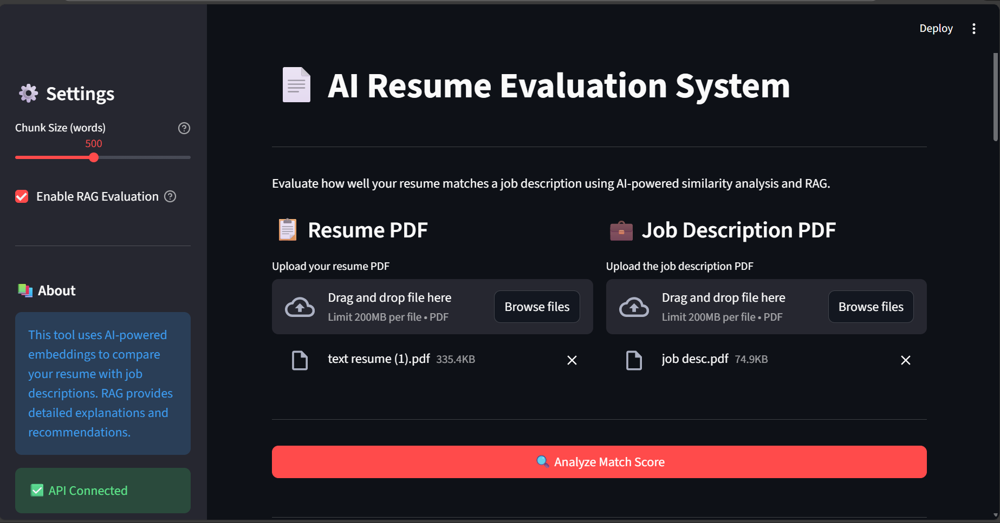
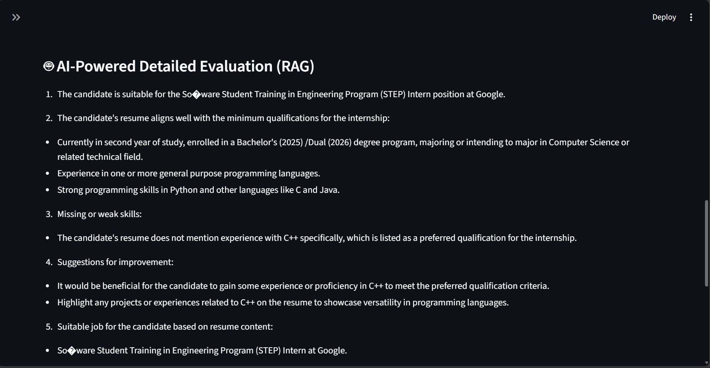
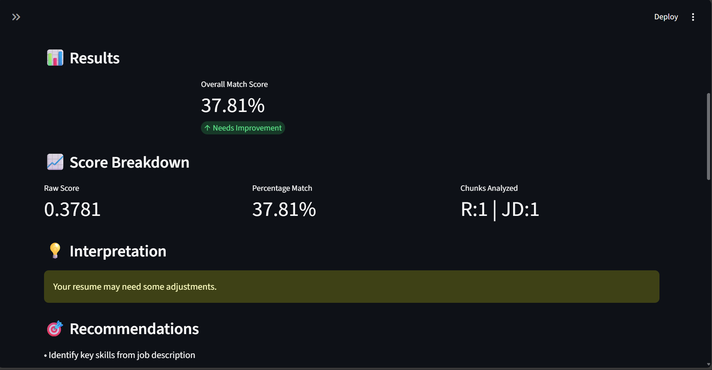

# AI Resume Evaluation System

 An intelligent system that evaluates resume-job description compatibility using advanced AI embeddings, semantic similarity analysis, and Retrieval-Augmented Generation (RAG).

[](https://www.python.org/downloads/)
[](https://fastapi.tiangolo.com/)
[](https://streamlit.io/)
[](LICENSE)

---

## 📋 Overview

The AI Resume Evaluation System leverages state-of-the-art Natural Language Processing to analyze resume-job description compatibility. By combining semantic embeddings, similarity scoring, and RAG-based AI reasoning, it provides actionable insights to help candidates optimize their applications.

### ✨ Key Features

- 🤖 **AI-Powered Analysis** - Uses OpenRouter embeddings and LLM reasoning
- 📊 **Semantic Similarity Scoring** - Computes match percentage between resume and job requirements
- 🔍 **RAG-Based Insights** - Retrieves relevant context and generates detailed recommendations
- 📄 **PDF Processing** - Supports text extraction with OCR fallback for scanned documents
- 🎨 **Interactive UI** - Clean, modern Streamlit interface
- 📈 **Detailed Reports** - Section-wise analysis with exportable results
- ⚡ **Real-Time Processing** - Fast evaluation with progress tracking

---

## 🏗️ Architecture

```
┌─────────────────┐         ┌──────────────────┐         ┌─────────────────┐
│   Streamlit UI  │  HTTP   │   FastAPI Backend│  API    │  OpenRouter AI  │
│   (Frontend)    │────────▶│   (REST API)     │────────▶│   (Embeddings)  │
└─────────────────┘         └──────────────────┘         └─────────────────┘
        │                            │
        │                            │
        ▼                            ▼
┌─────────────────┐         ┌──────────────────┐
│  File Uploads   │         │  PDF Processing  │
│  User Settings  │         │  Text Chunking   │
│  Results Display│         │  Vector Storage  │
└─────────────────┘         │  RAG Pipeline    │
                            └──────────────────┘
```

### Technology Stack

**Backend:**
- FastAPI - High-performance API framework
- OpenRouter - AI embeddings & LLM inference
- FAISS - Vector similarity search
- pdfplumber + Tesseract OCR - Document processing

**Frontend:**
- Streamlit - Interactive web interface
- Requests - API communication

---

# 📁 Project Structure

```
AI_RESUME_EVALUATION_SYSTEM/
│
├── backend/                    # FastAPI backend services
│   ├── api.py                 # Main API endpoints
│   ├── main.py                # Core pipeline orchestration
│   ├── pdf_loader.py          # PDF text extraction
│   ├── chunker.py             # Text chunking strategies
│   ├── embeddings.py          # Embedding generation
│   ├── similarity.py          # Similarity calculations
│   ├── llm.py                 # LLM API integration
│   └── rag/                   # RAG components
│       ├── vector_store.py    # Vector storage with FAISS
│       ├── retriever.py       # Context retrieval
│       ├── prompt.py          # Prompt templates
│       └── rag_pipeline.py    # RAG orchestration
│
├── frontend/                   # Streamlit UI
│   └── app.py                 # Main application interface
│
├── data/                       # Sample datasets
│   └── sample_input/          # Sample resume and job description
│       ├── text_resume (1).pdf      # Example resume
│       └── job_desc.pdf             # Example job description
│
├── images/                     # Project documentation images
│   ├── UI.png                 # Application user interface
│   ├── evaluation.png         # Evaluation results display
│   ├── result.png             # Match score results
│   └── retrieved_context.png  # RAG retrieved context chunks
│
├── temp_uploads/              # Temporary file storage
├── .env                       # Environment configuration
├── requirements.txt           # Python dependencies
├── .gitignore                 # Git ignore rules
└── README.md                  # Documentation
```

---

## 📸 Screenshots

### User Interface

*Clean and intuitive Streamlit interface with sidebar settings*

### Evaluation Dashboard

*Real-time evaluation with match percentage and recommendations*

### Match Score Results

*Detailed results display with interpretation and actionable insights*

### RAG Retrieved Context

*Relevant resume and job description chunks retrieved by RAG pipeline*

---

## 🚀 Getting Started

### Prerequisites

- Python 3.9 or higher
- Git
- Tesseract OCR (for scanned PDFs)
- OpenRouter API key ([Get one here](https://openrouter.ai))

### Installation

1. **Clone the repository**
   ```bash
   git clone https://github.com/your-username/AI-Resume-Evaluation-System.git
   cd AI-Resume-Evaluation-System
   ```

2. **Create virtual environment**
   ```bash
   # Windows
   python -m venv venv
   venv\Scripts\activate

   # macOS/Linux
   python3 -m venv venv
   source venv/bin/activate
   ```

3. **Install dependencies**
   ```bash
   pip install -r requirements.txt
   ```

4. **Install Tesseract OCR**
   
   **Windows:**
   - Download from [GitHub](https://github.com/UB-Mannheim/tesseract/wiki)
   - Install to `C:\Program Files\Tesseract-OCR`
   - Set environment variable:
     ```bash
     setx POPPLER_PATH "C:\path\to\poppler\bin"
     ```

   **macOS:**
   ```bash
   brew install tesseract poppler
   ```

   **Linux:**
   ```bash
   sudo apt-get install tesseract-ocr poppler-utils
   ```

5. **Configure environment variables**
   
   Create `.env` file in project root:
   ```env
   OPENROUTER_API_KEY=your_api_key_here
   POPPLER_PATH=C:\path\to\poppler\bin  # Windows only
   ```

---

## 🎮 Running the Application

### Start Backend (Terminal 1)

```bash
cd backend
python api.py
```

**Expected output:**
```
✓ All imports complete
INFO: Uvicorn running on http://0.0.0.0:8000
INFO: Application startup complete
```

**API Documentation:** http://localhost:8000/docs

### Start Frontend (Terminal 2)

```bash
cd frontend
streamlit run app.py
```

**Application URL:** http://localhost:8501

---

## 💡 How It Works

### Evaluation Pipeline

1. **Document Upload** - User uploads resume PDF and job description PDF
2. **Text Extraction** - PDFs processed with OCR fallback for scanned documents
3. **Text Chunking** - Documents split into semantic chunks (configurable size)
4. **Embedding Generation** - Each chunk converted to vector embeddings via OpenRouter
5. **Similarity Scoring** - Cosine similarity computed between resume and JD embeddings
6. **RAG Analysis** (Optional) - Relevant chunks retrieved and analyzed by LLM
7. **Report Generation** - Detailed match score, insights, and recommendations

### Scoring Interpretation

| Score Range | Match Level | Interpretation |
|------------|-------------|----------------|
| 75% - 100% | 🟢 Excellent | Strong alignment with job requirements |
| 50% - 74%  | 🟡 Good | Decent match with room for improvement |
| 0% - 49%   | 🔴 Needs Work | Significant gaps in required qualifications |

---

## 📊 API Endpoints

### Health Check
```http
GET /health
```
**Response:** `{"status": "healthy"}`

### Evaluate Resume
```http
POST /evaluate
```

**Parameters:**
- `resume` (file) - Resume PDF
- `job_description` (file) - Job description PDF
- `chunk_size` (int, default: 500) - Words per chunk
- `use_rag` (bool, default: true) - Enable RAG evaluation

**Response:**
```json
{
  "success": true,
  "score": 0.78,
  "score_percentage": "78.00%",
  "match_level": "Excellent",
  "interpretation": {
    "message": "Your resume is an excellent match for this job!",
    "recommendations": [...]
  },
  "rag_evaluation": {
    "enabled": true,
    "llm_response": "Detailed AI analysis...",
    "retrieved_resume_chunks": [...],
    "retrieved_jd_chunks": [...]
  }
}
```

---

## 🛠️ Configuration

### Adjustable Settings (via Streamlit UI)

- **Chunk Size** (100-1000 words) - Controls granularity of text analysis
- **RAG Evaluation** (On/Off) - Toggle LLM-powered detailed analysis

### Advanced Configuration (`.env`)

```env
# Required
OPENROUTER_API_KEY=sk-or-v1-xxxxx

# Optional (Windows)
POPPLER_PATH=C:\path\to\poppler\bin
TESSERACT_CMD=C:\Program Files\Tesseract-OCR\tesseract.exe
```

---

## 📦 Dependencies

Core libraries installed via `requirements.txt`:

```
fastapi>=0.109.0
uvicorn[standard]>=0.27.0
streamlit>=1.30.0
python-dotenv>=1.0.0
pdfplumber>=0.10.3
pdf2image>=1.17.0
pytesseract>=0.3.10
pillow>=10.2.0
requests>=2.31.0
numpy>=1.26.0
scikit-learn>=1.4.0
faiss-cpu>=1.7.4
```

---

## 🧪 Testing

### Quick Start with Sample Files

The `data/sample_input/` folder contains example files to test the system:

```bash
# Files available:
data/sample_input/
├── text_resume (1).pdf    # Sample candidate resume
└── job_desc.pdf           # Sample job posting
```

### Test Steps

1. **Start Backend**
   ```bash
   cd backend
   python api.py
   ```

2. **Start Frontend** (New Terminal)
   ```bash
   cd frontend
   streamlit run app.py
   ```

3. **Upload Sample Files**
   - Click "Browse files" under "Resume PDF"
   - Select `data/sample_input/text_resume (1).pdf`
   - Click "Browse files" under "Job Description PDF"
   - Select `data/sample_input/job_desc.pdf`

4. **Configure Settings (Optional)**
   - Adjust "Chunk Size" slider (default: 500 words)
   - Toggle "Enable RAG Evaluation" (default: ON)

5. **Run Analysis**
   - Click "Analyze Match Score"
   - View results and AI-powered recommendations
   - Download detailed report as text file

### Test Backend Health
```bash
curl http://localhost:8000/health
```

### Test API Documentation
Navigate to: http://localhost:8000/docs

---
